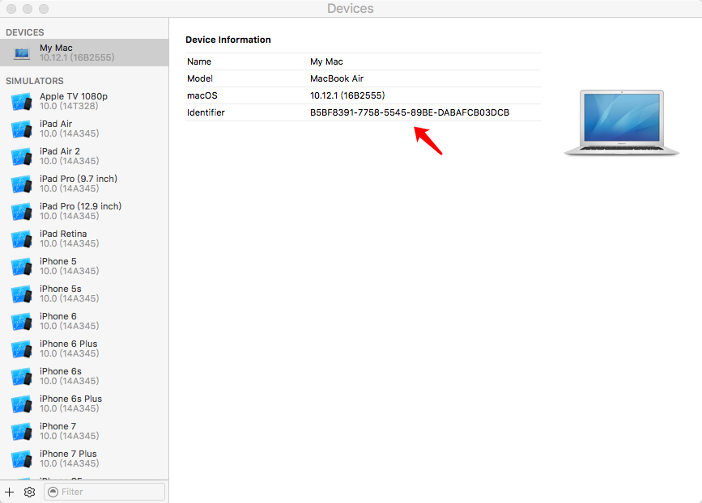
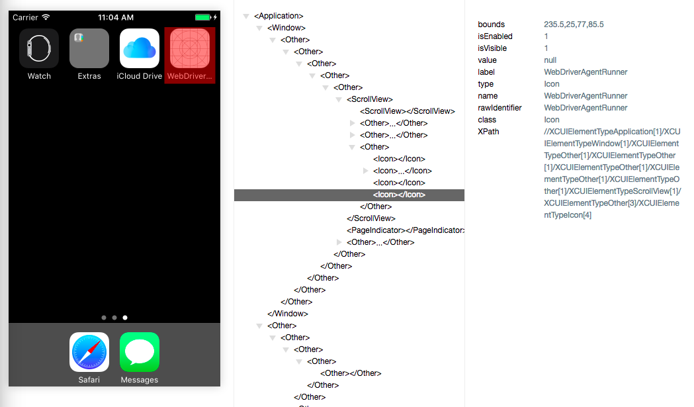
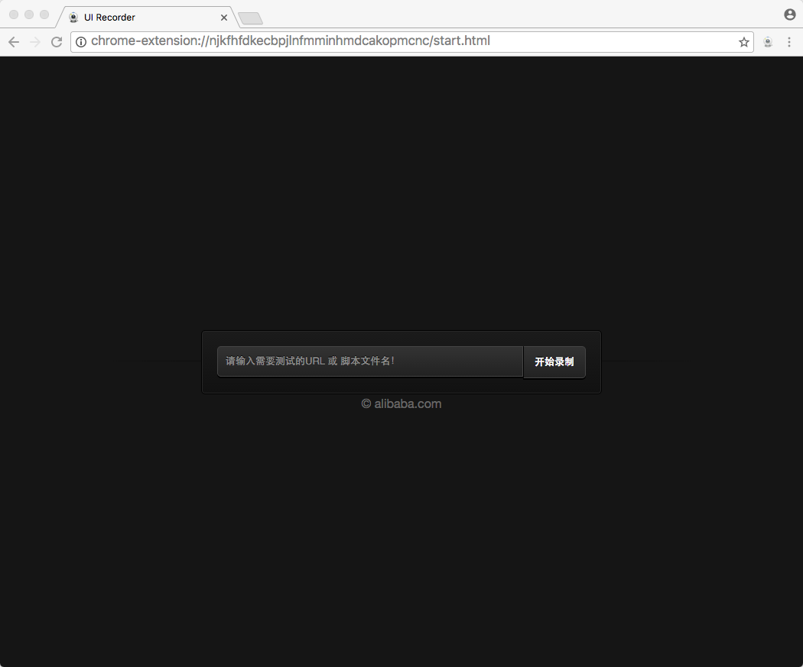
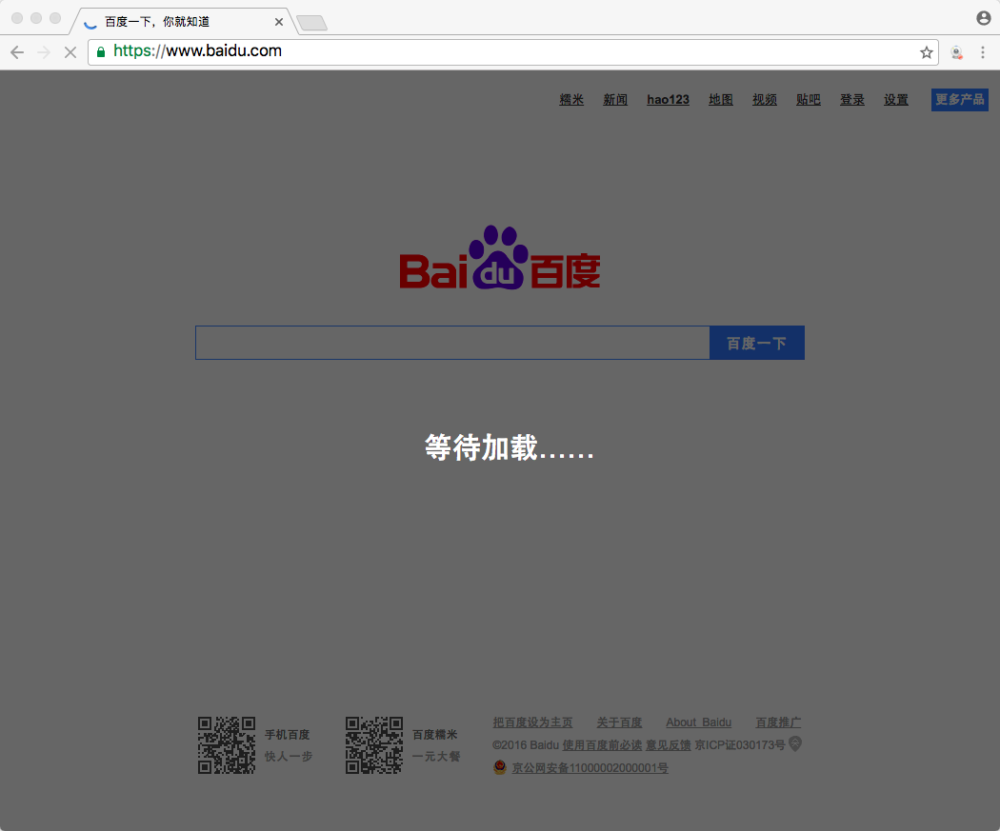
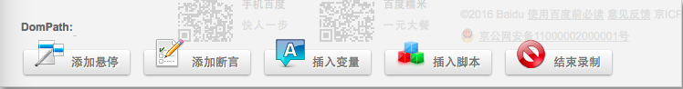
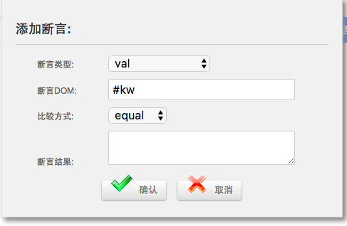
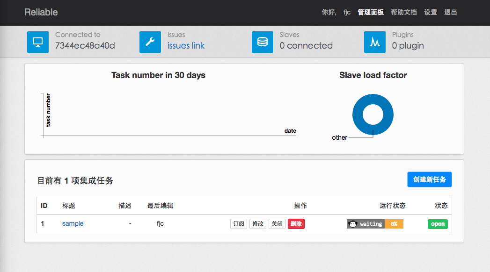
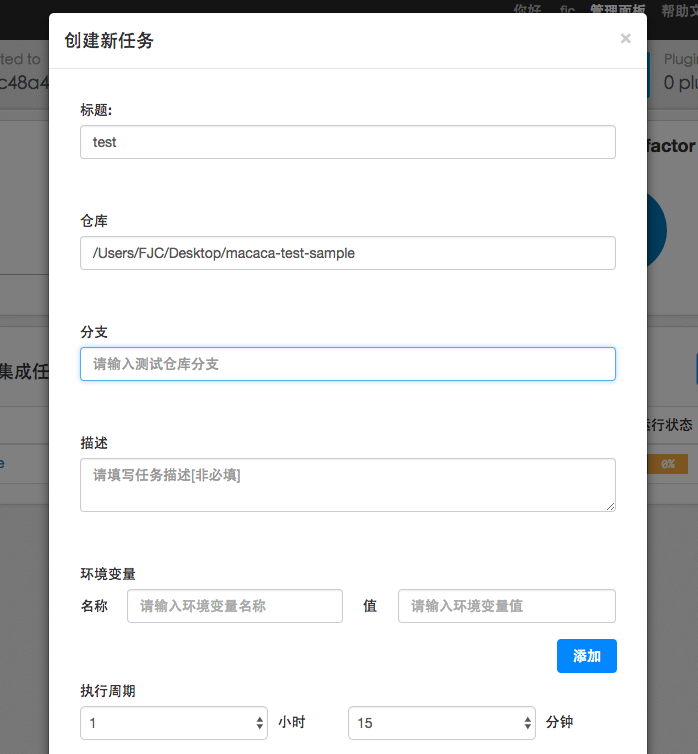
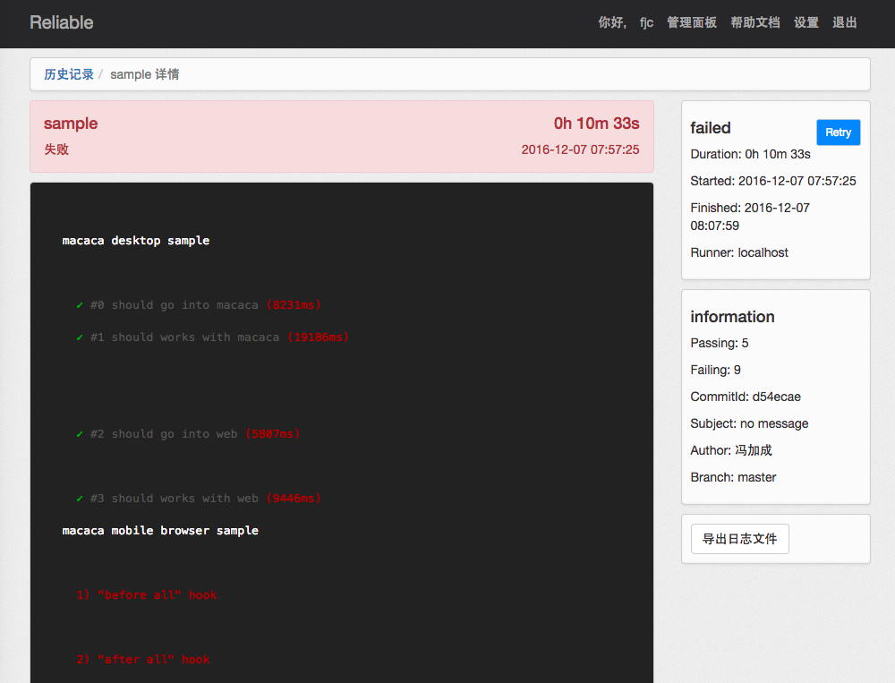

# macaca

## macaca工具集
* macaca cli
> macaca主程序
* diver
  * macaca-ios
  * macaca-android
  * macaca-chrome
  * macaca-electron
* Inspector
> 元素查看器
* Recorder
> 录屏工具
* Reliable

## 环境配置
### node
- node 4.6
- npm 2.15
- npm 换用淘宝源
> 在~/.npmrc 下 加入`registry = https://registry.npm.taobao.org`
- homebrew更新下，brew update无法更新，修改源 [这儿](https://my.oschina.net/hejunbinlan/blog/516845)

### macaca-cli
```shell
$ npm i  macaca-cli -g
```
### diver
```shell
$ npm i  macaca-ios -g
$ npm i  macaca-android -g
$ npm i  macaca-chrome -g
$ npm i  macaca-electron -g
```
### Android
- jdk1.8
- 配置ANDROID_HOME

### iOS
需要安装ios usb驱动
```shell
$ brew install usbmuxd
$ brew install ios-webkit-debug-proxy
```
安装成功的话
```shell
$ ios_webkit_debug_proxy

Listing devices on :9221
Connected :9222 to SIMULATOR (SIMULATOR)
```
浏览器打开 http://localhost:9221/json ，会看到设备信息
```
[{
   "deviceId": "SIMULATOR",
   "deviceName": "SIMULATOR",
   "url": "localhost:9222"
}]
```
如果连接不上：
- ios-webkit-debug-proxy版本问题。先homebrew更新，ios-webkit-debug-proxy安装最新的
- 删除libimobiledevice，用head装
```shell
$ brew install libimobiledevice@HEAD
```


### Inspector
```shell
$ npm i app-inspector -g
$ app-inspector -u xxxxxxxx-xxxx-xxxx-xxxx-xxxxxxxxxxxx
```
- ios
命令 `xcrun simctl list` 或者 打开模拟器，从菜单中打开` Hardware - devices - manage devices `。 然后你会看到模拟器信息界面，里面有个 identifier，就是 UDID。

http://localhost:5678/


- Android
```shell
$ adb devices
List of devices attached
9a5c614c	device
```


### Recorder
安装
```shell
$ npm install uirecorder mocha -g
```
#### PC
- 初始化
```shell
$ uirecorder init
$ npm install
```
- 录制脚本
```shell
$ uirecorder start sample/test.spec.js
```
会有两个浏览器打开，一个是录制浏览器，一个是校验浏览器



输入百度网址测试



边上有这个出现，表示校验浏览器也同时进行了这一操作的校验并成功


工具栏



插入断言



- 运行
```shell
$ source run.sh ( Linux|Mac )
$ run.bat ( Windows )
```

#### mobile
- 初始化
```shell
$ macaca server --port 4444
$ uirecorder init --mobile
$ npm install
```
- 录制脚本
```shell
$ uirecorder start --mobile sample/test.spec.js
```

- 运行
```shell
$ source run.sh ( Linux|Mac )
$ run.bat ( Windows )
```

查看用例报告
```
./reports/index.html
./reports/index.xml (JUnit)
./reports/index.json
./screenshots/
```

目前录屏在web上支持比较好，手机端用起来不是很方便没有插入断言的功能，需要在录制好脚本后，修改一定的脚本代码。


### Reliable

集中化测试平台,master-slave结构
* git >= 2.0
* docker >= 1.9.1
* docker compose >= 1.5.2

#### Master
1. 构建reliable-docker-base镜像
```shell
$ git clone https://github.com/reliablejs/reliable-docker-base --depth=1
$ cd reliable-docker-base
$ docker build -t="reliable-docker-base" .
```
2. 构建reliable-master镜像
```shell
$ git clone https://github.com/reliablejs/reliable-master --depth=1
$ cd reliable-master
$ docker build -t="reliable-master" .
```
3. 运行compose
```shell
$ git clone https://github.com/reliablejs/reliable-macaca-docker-compose.git --depth=1
$ cd reliable-macaca-docker-compose
$ make start
```
make start 通过docker-compose将 reliable-master、 mongodb、redis三个image组合使用，组合使用的配置在reliable-macaca-docker-compose的docker-compose.yml配置文件中。
master默认端口是8080，在makefile中修改。

```
# docker-compose.yml
reliable-master:
  container_name: "reliable-master"
  restart: "UNLESS-STOP"
  image: reliable-master
  ports:
    - "${RELIABLE_MASTER_PORT}:${RELIABLE_MASTER_PORT}"
  links:
    - mongo:mongo
    - redis:redis
  environment:
    - DB_SERVICE=mongo
    - DB_PORT=27017
    - DB_NAME=reliable_dev
  volumes:
    - /etc/localtime:/etc/localtime:ro
  command: /reliable-master/bin/reliable-master server -p ${RELIABLE_MASTER_PORT} --verbose

mongo:
  container_name: "reliable_mongo"
  restart: always
  image: mongo
  volumes:
    - /var/mongo/data/db:/data/db
    - /etc/localtime:/etc/localtime:ro

redis:
  container_name: "reliable_redis"
  restart: always
  image: redis
  volumes:
    - /etc/localtime:/etc/localtime:ro

# slave_1:
#   container_name: "slave_1"
#   restart: always
#   image: "reliable-macaca-slave"
#   links:
#     - reliable-master:reliable-master
#   volumes:
#     - /etc/localtime:/etc/localtime:ro
#   command: /reliable-macaca-slave/bin/reliable-macaca-slave server -m reliable-master:8083 --verbose
```

原本文件最后的slave节点也是用docker部署，从网络获取镜像，但实际操作获取不到，因此这里注释掉，docker只部署master节点及其依赖的mongodb和redis。

4. 创建用户
在Reliable-master容器里面执行`make adduser`， 选为 admin，才能在有删除任务的权限。

```shell
$ make adduser

./bin/reliable-master adduser

Do you want create an account? [Y/N]y

 User Id: admin1

 Email address: hmzxfjc@163.com

 Password: *************

 isAdmin [Y/N]: y

 Add user success!

 Goodbye! Have a great day!
```

#### slave

1. 安装

```shell
$ brew install pkg-config
$ brew install zeromq
$ npm install reliable-macaca-slave -g
```

如果要自己构建镜像

```shell
$ git clone https://github.com/reliablejs/reliable-macaca-slave.git
$ cd reliable-macaca-slave
$ docker build -f Dockerfile .
```

2. 连接master

```shell
$ reliable server -m <reliable-master:port> --verbose
```
#### reliable使用




*目前iOS Safari的测试官方还不支持*



## 测试用例

macaca提供了java、nodejs、python的api，以java为例。

### Java
java用maven构建项目
setting.xml:
```
      <settings
      	xsi:schemaLocation='http://maven.apache.org/SETTINGS/1.0.0 http://maven.apache.org/xsd/settings-1.0.0.xsd'
      	xmlns='http://maven.apache.org/SETTINGS/1.0.0' xmlns:xsi='http://www.w3.org/2001/XMLSchema-instance'>
      	<profiles>
      		<profile>
      			<repositories>
      				<repository>
      					<snapshots>
      						<enabled>false</enabled>
      					</snapshots>
      					<id>central</id>
      					<name>bintray</name>
      					<url>http://jcenter.bintray.com</url>
      				</repository>
      			</repositories>
      			<pluginRepositories>
      				<pluginRepository>
      					<snapshots>
      						<enabled>false</enabled>
      					</snapshots>
      					<id>central</id>
      					<name>bintray-plugins</name>
      					<url>http://jcenter.bintray.com</url>
      				</pluginRepository>
      			</pluginRepositories>
      			<id>bintray</id>
      		</profile>
      	</profiles>
      	<activeProfiles>
      		<activeProfile>bintray</activeProfile>
      	</activeProfiles>
      </settings>
```

pom.xml:
```
        ...
        <dependencies>
           <dependency>
             <groupId>macaca.webdriver.client</groupId>
             <artifactId>macacaclient</artifactId>
             <version>1.0.3</version>
           </dependency>
           <dependency>
             <groupId>com.alibaba</groupId>
             <artifactId>fastjson</artifactId>
             <version>1.2.15</version>
           </dependency>
           <dependency>
             <groupId>org.apache.httpcomponents</groupId>
             <artifactId>httpclient</artifactId>
             <version>4.5.2</version>
           </dependency>
           <dependency>
             <groupId>log4j</groupId>
             <artifactId>log4j</artifactId>
             <version>1.2.17</version>
           </dependency>
           <dependency>
             <groupId>junit</groupId>
             <artifactId>junit</artifactId>
             <version>4.12</version>
             <scope>test</scope>
           </dependency>
           <dependency>
             <groupId>org.hamcrest</groupId>
             <artifactId>hamcrest-library</artifactId>
             <version>1.2</version>
             <scope>test</scope>
           </dependency>
         </dependencies>
         ...
```

构建项目,安装依赖
```
$ mvn -s settings.xml clean install
```
测试代码见demo，详细见[API](https://macacajs.github.io/wd.java/)。
官方demo[macaca-test-sample-java](https://github.com/macacajs/macaca-test-sample-java)

开启macaca server
```
$ macaca server --verbose
```
运行
```
$ mvn test
```

### Node.js
js: [API](https://macacajs.github.io/macaca-wd/),用的是macaca-wd这个驱动

但是录屏生成的脚本用的驱动是[JWebDriver](https://github.com/yaniswang/jWebDriver)，两者不一致，api也有不同.
